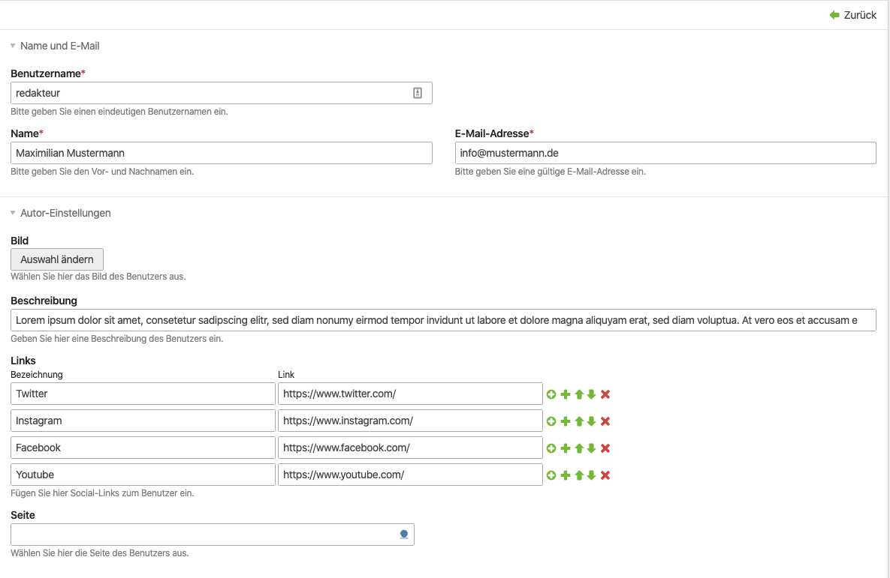
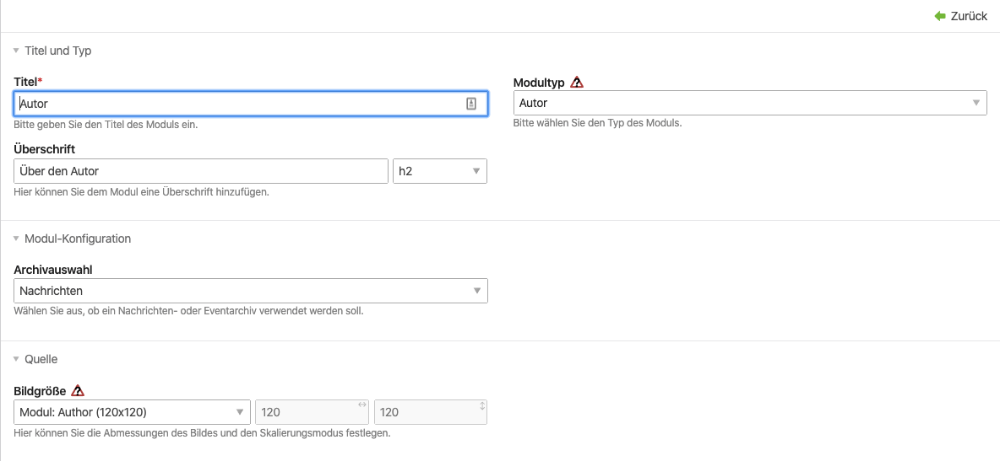
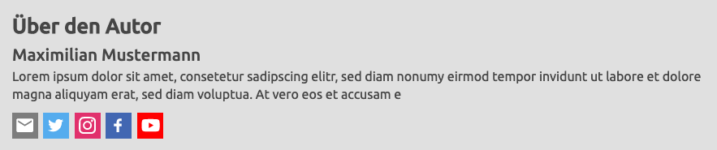

# Contao Author Bundle

Show additional author information on a reader page

## Installation

`composer require dreibein/contao-author-bundle`

## Usage
 
- Create a user
- Add author data to the user (description, image etc.)
- Create a frontend module "author" and set the scope (News, Events, FAQ)
- Insert the module on a reader page (e.g. above a news reader module)

## Features
- native Contao image support
- [schema.org](https://schema.org/author) author tags
- author data also added to the news-template-object

### News Template
The author data is added to the new template.
Following properties are available in the template:
- `$this->authorUser` (instance of Contao\UserModel)
- `$this->authorLinks` (array of links)
- `$this->authorImage` (image object)

The image object could be used this way:
```php
$this->insert('picture_default', $this->authorImage->picture);
```

### Back end view


### Module configuration


### Front end view (example)

